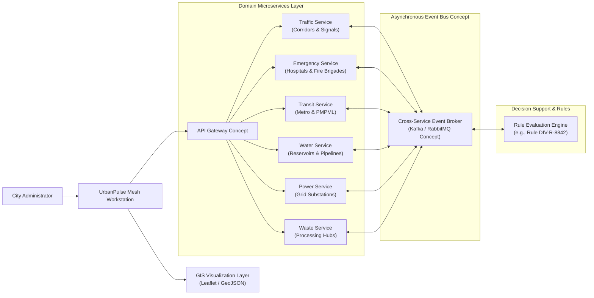

# UrbanPulse Mesh

**Municipal Coordination & Decision Support System**

UrbanPulse Mesh is a frontend-based high-fidelity municipal decision-support workstation designed for City Administrators and Municipal Operations Teams in Pune, Maharashtra. It unifies geographic information systems (GIS), cross-domain infrastructure mapping, and simulated operational telemetry into a cohesive single-pane-of-glass interface. Built as an academic B.Tech System Design prototype, the platform enables municipal operators to inspect urban infrastructure, evaluate multi-agency incidents, coordinate diversion strategies, and manage urban services with high usability and multilingual accessibility.

[](https://react.dev/)
[](https://vitejs.dev/)
[](https://leafletjs.com/)
[](https://tailwindcss.com/)
[-informational?style=flat-square)]()

---

## 1. Overview

UrbanPulse Mesh serves as a spatial decision-support prototype modeled after the operational realities of the Pune Municipal Corporation (PMC) administrative region. The platform addresses the critical challenge of departmental fragmentation in urban governance by synthesizing spatial and operational datasets into an interactive workstation.

Through the unified GIS interface, a City Administrator can:
- **View Pune's Geographic Context**: Explore ward boundaries, major arterial corridors, hydrological networks (Mula-Mutha rivers), and key landmarks.
- **Inspect Municipal Infrastructure**: Access spatial locations, status indicators, and metadata for public healthcare facilities, fire stations, transit nodes, water distribution utilities, electrical substations, and solid waste facilities.
- **Categorize Information by Service Domain**: Filter GIS layers and telemetry data across six core municipal domains without losing the overarching spatial context.
- **Monitor Simulated Operational Conditions**: Review simulated telemetry for arterial congestion levels, reservoir capacities, power grid stability, and municipal fleet movements.
- **Inspect Active Incidents**: Examine prioritized municipal incidents with spatial pinning, assigned response units, and proximity analysis to key facilities.
- **Review Decision-Support Proposals**: Evaluate system-generated intervention recommendations with impact forecasts and congestion delta metrics.
- **Visualize Coordinated Diversion Routes**: Overlay dynamic road closures, primary diversion corridors, and signal retiming corridors directly on the map.
- **Inspect Service-Specific Details**: Examine cross-agency dependencies and status shifts resulting from active incidents or maintenance events.
- **Multilingual Interaction**: Switch seamlessly between English, Hindi (हिन्दी), and Marathi (मराठी) with full interface localization.
- **Interactive Layer Controls**: Toggle GIS layers, adjust base maps, and inspect geographic entities via contextual slide-overs and modals.

> **Academic Prototype Notice**: UrbanPulse Mesh is an academic System Design prototype developed for academic evaluation and demonstration. It is not connected to live municipal dispatch systems or active government IoT feeds.

---

## 2. Problem Statement

Municipal administration in large metropolitan regions such as Pune requires continuous coordination across multiple municipal departments, including traffic policing, emergency medical services, fire brigades, public transit (PMPML & Maha-Metro), water supply, electrical distribution, and solid waste management.

In traditional municipal workflows, operational information is siloed across independent administrative systems. This fragmentation creates severe operational bottlenecks during urban disruptions:
1. **Lack of Common Spatial Context**: Departmental operators struggle to assess how an incident in one sector (e.g., an arterial road blockage) impacts adjacent services (e.g., hospital ambulance corridors, metro feeder routes, or water tanker logistics).
2. **Delayed Impact Assessment**: Identifying affected corridors, nearest critical facilities, and vulnerable wards requires manual cross-referencing between disconnected tools.
3. **Uncoordinated Interventions**: Traffic diversions, signal adjustments, and emergency deployments frequently occur without visibility into cross-service ripple effects.
4. **Cognitive Overload**: Operators are inundated with disjointed alerts without clear visual hierarchy or automated decision-support recommendations.

UrbanPulse Mesh addresses these challenges through a unified spatial decision-support interface that correlates geographic infrastructure with operational conditions and cross-domain impact models.

---

## 3. Objectives

1. **Unified GIS Operations Interface**: Provide a single-pane-of-glass interface combining cartographic visualization with operational telemetry.
2. **Pune Spatial & Infrastructure Visualization**: Faithfully represent Pune's administrative wards, road networks, hydrological features, and civic facilities.
3. **Structured Municipal Categorization**: Organize urban assets and operational states into six clearly delineated municipal domains.
4. **Incident Inspection & Decision Support**: Implement structured incident workflows from detection to automated diversion recommendation and confirmation.
5. **Cross-Service Impact Analysis**: Model and display ripple effects across interconnected municipal services when an incident occurs.
6. **HCI-Compliant Interaction Design**: Apply established human-computer interaction (HCI) principles to minimize cognitive load and prevent operator error.
7. **Trilingual Localization**: Provide native support for English, Hindi, and Marathi to reflect regional governance requirements.
8. **Clear Data Distinction**: Maintain strict architectural separation between authentic static GIS base data and dynamic simulated operational telemetry.
9. **Microservices Conceptual Modeling**: Demonstrate a modular, domain-driven microservices architecture suitable for civic digital twin implementations.
10. **Academic Rigor**: Provide a fully documented, academically sound system design artifact suitable for B.Tech project defense and peer review.

---

## 4. Core Municipal Service Domains

UrbanPulse Mesh structures municipal operations into six core domains:

| Domain | Scope & Purpose | Represented Infrastructure & Telemetry |
| :--- | :--- | :--- |
| **Traffic** | Road corridors, congestion monitoring, signal management, and diversion routing | Major arterials (FC Road, JM Road, Senapati Bapat Rd, Karve Rd), traffic density, signal phase status, dynamic diversion corridors |
| **Emergency** | Emergency medical response, trauma facilities, fire services, and perimeter control | Super-speciality hospitals, government trauma centers, municipal fire stations, active ambulance and fire brigade unit telemetry |
| **Transit** | Multimodal public transit network, metro lines, and bus operations | Maha-Metro Line 1 & Line 2 alignments and stations, PMPML bus terminals, transit corridor congestion |
| **Water** | Potable water supply, treatment facilities, distribution reservoirs, and urban water bodies | Parvati & Cantonment water treatment plants, overhead reservoirs, distribution pipeline pressure nodes, Mula-Mutha rivers, Pashan Lake |
| **Power** | High-voltage transmission substations, feeder networks, and grid reliability | 220/132 kV MSETCL substations, MSEDCL distribution feeder substations, grid load telemetry, transformer status |
| **Waste** | Solid waste management logistics, transfer stations, processing plants, and processing capacity | Uruli Devachi processing plant, decentralized transfer stations, biomethanation facilities, daily waste tonnage processing |

---

## 5. Key Features

### GIS-Based Municipal Map
- **Pune-Centered Geospatial Engine**: Interactive map canvas built on Leaflet and React-Leaflet, centered on Pune coordinates (`18.5204° N, 73.8567° E`).
- **OpenStreetMap Integration**: Clean cartographic base tiles styled for high-contrast visibility in operational environments.
- **Multi-Layer Geospatial Data**:
  - **Administrative Ward Boundaries**: Interactive polygons representing Pune's 15 administrative ward divisions (Aundh-Baner, Shivajinagar-Ghole Road, Kasba-Vishrambaugwada, Kothrud-Bavdhan, Hadapsar-Mundhwa, etc.) with population and area metrics.
  - **Hydrological Network**: Accurate geometries for the Mula, Mutha, and Mula-Mutha confluence rivers, along with Pashan and Katraj lakes.
  - **Road Network & Corridors**: Primary arterial centerlines with directional designations and operational corridor markers.
  - **Civic Infrastructure**: Geospatially anchored markers for hospitals (Sassoon, KEM, Sahyadri, Deenanath Mangeshkar), fire stations (Central Fire Station Bhawani Peth, Erandwane, Kothrud), metro stations, water treatment plants, power substations, and waste processing hubs.
- **Adaptive Level-of-Detail (LoD)**: Zoom-dependent rendering that declutters minor infrastructure markers at regional zoom levels while revealing detailed operational nodes upon zooming in.
- **Incident Pinning & Diversion Overlays**: Real-time spatial rendering of incident epicenter markers, perimeter safety zones, and color-coded diversion pathways.

### Municipal Service Categorization
The workstation provides interactive domain filtering controls that let operators switch between:
- `ALL` — Comprehensive city-wide overview combining all infrastructure layers.
- `TRAFFIC` — Isolated road network, real-time corridor congestion, and signal states.
- `EMERGENCY` — Hospitals, trauma centers, fire stations, and emergency vehicle staging areas.
- `TRANSIT` — Metro lines, transit hubs, and feeder routes.
- `WATER` — Reservoirs, treatment plants, distribution pipelines, and natural water bodies.
- `POWER` — High-voltage grid substations, regional feeders, and electrical load zones.
- `WASTE` — Solid waste transfer stations, processing facilities, and collection logistics.

Filtering selectively emphasizes relevant map layers and telemetry cards while preserving underlying spatial landmarks for uninterrupted geographic orientation.

### Incident Decision Support Workflow
The decision-support engine guides the administrator through an end-to-end incident mitigation workflow:

```
[Incident Notification]
         │
         ▼
[Incident Inspection] ──► (View Coordinates, Severity, Involved Units, Nearest Facilities)
         │
         ▼
[Cross-Service Impact Summary] ──► (Identify Affected Services: Traffic, Emergency, Transit)
         │
         ▼
[Decision-Support Proposal] ──► (System evaluates Rule: DIV-R-8842 with Before/After Metrics)
         │
         ▼
[Operator Confirmation] ──► (Explicit Two-Step Action to Prevent Accidental Execution)
         │
         ▼
[Coordinated Diversion Execution]
         │
         ├─► [Map Layer Update]: Dynamic reroute corridor & signal retiming rendered on GIS
         ├─► [Service Telemetry Update]: Impact delta (-8 min travel time, congestion 86% -> 42%)
         └─► [Audit Trail Record]: Immutable entry logged in Municipal Operations Audit Log
```

#### Implemented Reference Case: Incident `UP-1024`
- **Title**: Multi-Vehicle Collision & Transit Stoppage
- **Location**: FC Road near Goodluck Chowk (`Ward 10 - Shivajinagar / Deccan`)
- **Severity**: HIGH (`Response in Progress`)
- **Affected Domains**: Traffic, Emergency, Transit
- **Assigned Units**: Erandwane Fire Engine #04 (On-Scene), 108 Ambulance #12 (En Route - 2 min), Deccan Traffic Sector Unit 3 (Managing Perimeter)
- **Nearest Critical Facility**: Sahyadri Super Speciality Hospital (0.9 km)
- **Decision Rule**: `DIV-R-8842` — Reroute northbound traffic via Senapati Bapat Road; shift signal green phase +45s on JM Road.
- **Projected Impact**: Travel time reduced from 24 min to 16 min (-8 min delta); corridor congestion reduced from 86% to 42%.

### Search & Spatial Navigation
- **Unified Query Bar**: Instantaneous client-side indexing and searching across road names, civic facilities, ward boundaries, incident identifiers, and municipal asset categories.
- **Keyboard Navigation**: Quick focus shortcuts, keyboard navigation for search results, and instantaneous map pan-and-zoom to selected entities.

### Multilingual Interface (i18n)
- **Supported Languages**:
  - English (`en`)
  - Hindi (`hi` — हिन्दी)
  - Marathi (`mr` — मराठी)
- **Instantaneous Language Switching**: Reactive translation switching without page reloads or loss of map state.
- **Persistent Preference**: Operator language selection is saved in local browser storage across sessions.
- **Culturally & Administratively Accurate Terminology**: Localized terminology for municipal wards, emergency services, civic departments, and system status indicators while preserving recognized geographic proper nouns.

### HCI-Oriented Interaction Design
The interface is designed according to established Human-Computer Interaction (HCI) frameworks, specifically **Shneiderman's Eight Golden Rules of Interface Design** and **Norman's Action Cycle**:
- **Consistency**: Standardized color tokens, typography hierarchy, and status indicators across all modules.
- **Visibility of System Status**: Real-time indicators for system time, active filter states, coordinate overlays, and simulated telemetry feeds.
- **Informative Feedback**: Clear visual badges, toast confirmations, and transition animations for all user actions.
- **Error Prevention & Confirmation**: Multi-step confirmation dialogues before executing critical incident diversion plans or resetting simulated telemetry.
- **User Control & Freedom**: Easy cancellation of modals, dismissible slide-overs, and full zoom/pan control on the GIS canvas.
- **Reduced Cognitive Load**: Card-based telemetry summaries, high-contrast typography, and contextual filtering preventing visual clutter.

---

## 6. Conceptual Architecture

UrbanPulse Mesh models a modern, event-driven municipal microservices platform. The frontend workstation interfaces conceptually with specialized domain microservices via an API gateway, with cross-agency coordination managed by an asynchronous event bus.



---

## 7. Technology Stack

| Layer | Technology | Purpose |
| :--- | :--- | :--- |
| **Framework** | [React 18.3.1](https://react.dev/) | Component-based UI rendering and reactive state management |
| **Build Tool** | [Vite 6.1.0](https://vitejs.dev/) | Fast development server and optimized ES module bundling |
| **GIS / Mapping** | [Leaflet 1.9.4](https://leafletjs.com/) & [React-Leaflet 4.2.1](https://react-leaflet.js.org/) | Geospatial canvas, GeoJSON polygon rendering, and tile layer control |
| **Styling** | [Tailwind CSS 3.4.17](https://tailwindcss.com/) & Vanilla CSS | Responsive layout, dark theme styling, and accessible UI tokens |
| **Icons** | [Lucide React 0.475.0](https://lucide.dev/) | Clean, accessible SVG iconography for municipal operations |
| **Localization** | Custom React Context i18n Engine | Dynamic switching across English, Hindi, and Marathi |

---

## 8. Repository Structure

```
UrbanPulse-Mesh/
├── index.html                  # HTML entry point with viewport and metadata configurations
├── package.json                # Project dependencies, build scripts, and metadata
├── vite.config.js              # Vite bundler configuration
├── tailwind.config.js          # Tailwind CSS theme extensions and color system
├── postcss.config.js           # PostCSS configuration for Tailwind and Autoprefixer
├── src/
│   ├── main.jsx                # Application root mounting and provider wrapping
│   ├── App.jsx                 # Main application layout, state coordination, and routing
│   ├── index.css               # Global stylesheets, Leaflet overrides, and animations
│   ├── components/
│   │   ├── analytics/          # Cross-service analytics and KPI visualization modules
│   │   ├── auth/               # Role-based municipal operator profile and session display
│   │   ├── layout/             # Top navigation bar, header, status tickers, and footers
│   │   ├── map/                # GIS Leaflet canvas, layer controls, markers, and legend
│   │   ├── operations/         # Incident manager, decision-support cards, and audit log
│   │   ├── pages/              # Primary view pages (Workstation, Analytics, Reports)
│   │   ├── services/           # Municipal service domain inspectors and telemetry cards
│   │   ├── simulation/         # Simulation scenario controls and time-scale toggles
│   │   └── system/             # System health monitors, telemetry feeds, and modals
│   ├── data/
│   │   ├── geo/                # Static Pune GIS datasets (Wards, Rivers, Roads, Facilities)
│   │   ├── incidents.js        # Realistic simulated incident definitions and response units
│   │   ├── infrastructure.js   # Municipal infrastructure asset registry and metadata
│   │   ├── municipalServices.js# Domain configuration, operational baselines, and status definitions
│   │   ├── puneMapData.js      # Consolidated GIS layers and coordinate definitions
│   │   └── simulatedTelemetry.js# Operational telemetry simulation generators
│   └── i18n/
│       ├── index.jsx           # Internationalization React Context and translation hook
│       └── locales/
│           ├── en.js           # English translations
│           ├── hi.js           # Hindi (हिन्दी) translations
│           └── mr.js           # Marathi (मराठी) translations
```

---

## 9. Getting Started

### Prerequisites
- [Node.js](https://nodejs.org/) (version `18.x` or later recommended)
- `npm` (version `9.x` or later)

### Installation & Local Setup

1. **Clone the Repository**:
   ```bash
   git clone https://github.com/VaishnaviNehare13/UrbanPulse-Mesh.git
   cd UrbanPulse-Mesh
   ```

2. **Install Dependencies**:
   ```bash
   npm install
   ```

3. **Launch the Development Server**:
   ```bash
   npm run dev
   ```

4. **Access the Workstation**:
   Open your browser and navigate to `http://localhost:3000` (or the port indicated in your terminal).

### Available Scripts

| Script | Command | Purpose |
| :--- | :--- | :--- |
| **Development** | `npm run dev` | Starts the Vite development server with hot module replacement (HMR) |
| **Production Build** | `npm run build` | Compiles and optimizes assets into the `dist/` directory |
| **Preview Build** | `npm run preview` | Locally serves the production build for validation |

---

## 10. Data Sources & Geographic Attribution

The static geospatial datasets utilized in this prototype are derived from and cross-referenced with public open data sources:

- **Administrative Wards**: Pune Municipal Corporation (PMC) administrative boundary datasets via [OpenCity.in](https://opencity.in/).
- **Hydrological Network & Roads**: [OpenStreetMap](https://www.openstreetmap.org/) contributors under the Open Database License (ODbL).
- **Public Healthcare & Fire Stations**: PMC Open Data registry and public civic listings.
- **Public Transit**: Pune Mahanagar Parivahan Mahamandal Ltd (PMPML) and Maha-Metro Line 1 & 2 published route alignments.

---

## 11. Academic Context & Disclaimer

This project is developed as a **B.Tech System Design Prototype** to explore the intersection of Geographic Information Systems (GIS), Human-Computer Interaction (HCI), and Municipal Decision Support Architectures. 

- All operational metrics, incident scenarios, sensor feeds, and telemetry streams are **simulated** for prototype demonstration.
- This software is **not** connected to any government or municipal live control infrastructure.
- Designed strictly for academic research, education, and software design demonstration.
